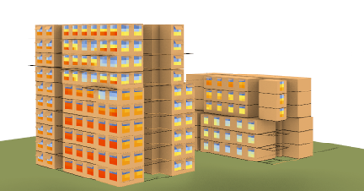

# Parametric Shading Optimization

This project showcases the use of **Grasshopper** for optimizing sunshading elements in a multi-storey mixed-use building. The aim was to enhance the building's energy efficiency and occupant comfort by minimizing solar gain during summer while allowing enough sunlight in winter.

## Project Overview
- **Objective**: Optimize shading elements to balance solar exposure throughout the year.
- **Key Tools**: 
  - **Grasshopper**: Used for parametric shading design and optimization.
  - **Rhino**: Provided the base geometry for the building model.
- **Methodology**:
  - Incorporated adjustable shading parameters such as depth, angle and orientation.
  - Utilized Grasshopper's **Evolutionary Solver** to iteratively refine shading configurations based on solar energy calculations.

## Grasshopper Parametric Design
1. **Model Integration**: The building's geometry, including rooms and windows, was modeled in Rhino and linked to Grasshopper.
2. **Shading Parameters**:
   - Depth: Adjustable from 0 to 0.5 m.
   - Angle: Ranged from -50° to 50°.
   - Orientation: Horizontal or vertical, with positions such as top, bottom, left or right.
3. **Optimization**:
   - Calculated incident solar energy for each window and room orientation.
   - Minimized the difference between summer and winter solar exposure using Grasshopper's **Evolutionary Solver**.

## Files in This Repository
- **Building_shades.3dm**: Rhino file containing the building geometry. Required for running the Grasshopper script.
- **sun_building.gh**: Grasshopper file performing shading optimization.

